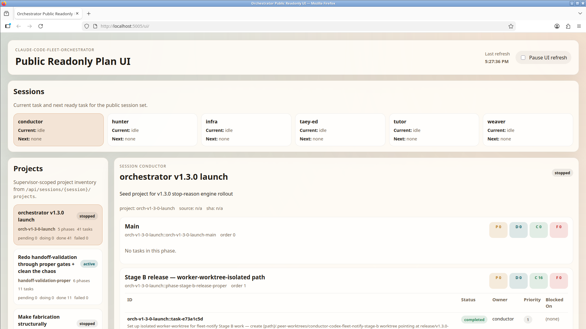

Auditing the claims? Start at AUDIT.md.

# claude-code-fleet-orchestrator

`claude-code-fleet-orchestrator` is a local-first, single-user orchestration layer for a fleet of Claude Code or CLI agent sessions running on one operator's machine. It is not a hosted service, not a multi-tenant team server, and not a SaaS control plane. The default posture is private: the mutable API and dashboard bind to `127.0.0.1` unless the operator explicitly sets `ORCH_HOST` to another interface.

The system gives one person a durable "score" for coordinating multiple coding agents without babysitting every handoff. State lives in Neo4j and Redis because projects, phases, tasks, dependencies, human-review gates, refs, and provenance are graph-shaped; the product asks "what is ready, blocked, supervised, or gated?" more often than it asks for flat rows. A FastAPI service on `:5002`, a browser dashboard, command-line tools, and Claude Code hooks connect each session's lifecycle to that state.

Motivating scenario: you have `supervisor`, `worker-codex`, and `worker-gemini` sessions open on one Linux workstation. Codex is implementing, Gemini is measuring, and the supervisor is coordinating. Without a shared score, work gets lost after `/clear`, a worker can stop while a dependent task is ready, and "done" becomes a chat claim. This repo makes those handoffs explicit local state.



Screenshot: local `:5005` read-only dashboard view with real fleet state. The operator API/dashboard runs on `:5002`; `:5005` is a separate read-only dashboard surface served by `scripts/orch-public`, useful when you want a scrubbed view without mutable routes.

Status: active single-user local tool, Apache-2.0 licensed (see [CHANGELOG.md](CHANGELOG.md) and the GitHub releases for the current version — the version is not duplicated here, where it would drift). It is mature enough to run its own ship gates, but it still expects a technical operator comfortable with local Redis, Neo4j, and Claude Code hook wiring.

## Mental Model

You run several Claude Code or CLI sessions as a fleet. The orchestrator keeps the shared project score: projects contain phases, phases contain tasks, and each task has an owner, status, priority, dependencies, optional refs, and completion evidence.

**Stop-discipline engine.** The hook path is designed so a session does not silently stop while it still has ready work. The Stop hook asks the orchestrator for a stop decision; if work remains and hooks are installed, the hook blocks the stop and feeds back the next action. Human-review gates are a first-class stop state: when work is waiting on a person, the session can stop cleanly instead of looping.

**Dynamic context injection.** Plans and tasks can attach reference docs at overall, supervisor, project, phase, and task tiers. `GET /api/sessions/{session_id}/wake-packet` is enabled by default and assembles a task-scoped packet with operating guidance, a per-role identity tier, refs, ranked memory, rules, provenance, and a size report. Managed notify hooks surface that scoped packet on `SessionStart`, `UserPromptSubmit`, and `PostToolUse` when the local API can provide it. `dispatch()` also assembles the same packet directly, embeds the dispatch body inside it, and sends that rendered packet through `taey-notify`; before mutating task state it refuses targets whose CLI hook settings do not contain the managed notify hooks. `ORCH_WAKE_PACKET_ENDPOINT_ENABLED=0` disables only the endpoint; the old `ORCH_WAKE_PACKET_ENABLED` name remains as a deprecated alias. This pairs with `/clear`: clear accumulated chat context, then re-inject the clean slice for the current task. Empty refs mean none were attached; that is valid.

**Evidence-gated completion.** Terminal task updates require evidence; the API rejects evidence-less terminal claims. The evidence body is still first shape-checked so empty/trivial/malformed values do not pass. Completed tasks also surface `completion_evidence_verification`: `VERIFIED` means the GitHub commit exists and the required independent gate contexts (`r5-audit-gate` and `ship-gate-acceptance` by default) passed for that exact `commit_sha`; `UNVERIFIED` means the task is completed with only a shape-valid self-report. Local/non-repo completions and completions without a `commit_sha` remain honestly `UNVERIFIED` instead of pretending to be proven. Human-review gate tasks must be completed through the question/UI path.

**AI-Native / AI-First / AI-Speed.** The primary operator is an AI agent moving through local state at speed, so every surface should teach its own use in band. Errors, wake packets, CLI output, and API responses should say what the agent has, why it is blocked or ready, and what to do next. "See the docs" and "ask the operator" are bugs when the output could teach the next step directly. See [CONTRIBUTING.md](CONTRIBUTING.md#ai-native--ai-first--ai-speed) for the contributor rule and [PR #163](https://github.com/palios-taey/claude-code-fleet-orchestrator/pull/163) for the first worked example.

## Five-Minute Quickstart

Prerequisites:

- Linux or a Linux-like environment with a POSIX shell
- Python 3.10+ with `venv`
- Git
- Docker Compose for the bundled Redis + Neo4j path
- Claude Code
- `claude-code-fleet-notify` as a sibling checkout, required for Claude Code hooks and the stop-discipline loop

Use one canonical first-run path: install into a local `.venv`, start the bundled loopback Redis/Neo4j, then run the API/dashboard with `orch serve`. After that smoke test is green, wire Claude Code hooks through `claude-code-fleet-notify` to enable stop discipline.

```bash
git clone https://github.com/palios-taey/claude-code-fleet-orchestrator.git
git clone https://github.com/palios-taey/claude-code-fleet-notify.git
cd claude-code-fleet-orchestrator
python3 -m venv .venv
. .venv/bin/activate
python -m pip install --upgrade pip
python -m pip install -e .
cp .env.example .env
```

The installed CLIs are Python entry points into the editable checkout. After a `git pull --ff-only`, the `taey-*`, `orch`, `install`, `orch-cron`, `orch-watch`, and `fleet-orchestrator-api` commands load the updated checkout without reinstalling copied script files.

To update an existing local deployment:

```bash
git pull --ff-only
python -m pip install -e .
orch --version
orch doctor --explain-scope
orch disable
orch enable
curl -s http://127.0.0.1:5002/health
```

Run the editable install command again when dependency metadata changes. The entry-point wrappers themselves stay stable; `--version` reports the live checkout version and catches stale non-editable installs during verification.

The bundled compose file sets `NEO4J_AUTH=none`. Neo4j and Redis bind to loopback and run **without auth** — the orchestrator does not support internal-service credentials (the network is the trust boundary; run these on a trusted host/LAN):

```bash
docker compose up -d
```

If Docker is unavailable and you already run Redis and Neo4j yourself, edit `.env` first and use `scripts/install --skip-compose`. Run your Neo4j with auth disabled (`NEO4J_AUTH=none`):

```bash
ORCH_REDIS_HOST=127.0.0.1
ORCH_REDIS_PORT=6379
REDIS_HOST=127.0.0.1
REDIS_PORT=6379
ORCH_NEO4J_URI=bolt://127.0.0.1:7687
ORCH_NEO4J_DB=neo4j
```

Verify the install:

```bash
orch serve
```

In another terminal:

```bash
. .venv/bin/activate
curl -s http://127.0.0.1:5002/health
```

Open the dashboard:

```bash
open http://127.0.0.1:5002/ui/
```

If `open` is not available on your OS, paste `http://127.0.0.1:5002/ui/` into a browser on the same machine.

Wire Claude Code hooks after the API/dashboard smoke test. This step is required for the Stop hook behavior described above; without it, the API and dashboard work, but sessions will not consult the orchestrator when they stop.

```bash
scripts/install --dry-run
scripts/install --skip-compose
```

`--skip-compose` reuses the Redis and Neo4j you already started with Docker Compose. The installer reconciles `.venv`, applies managed Claude Code hook settings through `claude-code-fleet-notify`, starts notify daemons, starts `orch-watch`, and runs `orch doctor`.

For automation, the package also exposes `fleet-orchestrator-api`, which starts the same FastAPI app as `orch serve`. Prefer `orch serve` in the quickstart because it prints the dashboard URL and uses the same operator lifecycle surface as `orch enable`, `orch disable`, and `orch doctor`.

## Configuration

Copy [.env.example](.env.example) to `.env`. The loader reads `ORCH_DOTENV` first if set, then `.env` in the current directory, then `.env` at the repo root. Set `ORCH_DOTENV=empty` for tests or probes that must assert built-in defaults instead of deployment-specific `.env` values; normal operator runs can leave auto-discovery enabled.

Required:

- `ORCH_REDIS_HOST` and `ORCH_REDIS_PORT`: Redis used by orchestrator API/dashboard state, locks, receipts, and other orchestrator-owned runtime state.
- `REDIS_HOST` and `REDIS_PORT`: Redis used by `claude-code-fleet-notify` session state: dispatch `current_task`, Stop-hook `idle`/outcome state, session pause, and worker liveness. In normal local installs, set these to the same host/port as `ORCH_REDIS_*`; split them only when intentionally testing config divergence.
- `ORCH_NEO4J_URI` and `ORCH_NEO4J_DB`: Neo4j used for projects, phases, tasks, refs, gates, and evidence. Run Neo4j with auth disabled (`NEO4J_AUTH=none`) — the orchestrator connects with no credentials and does not support internal-service auth.

Network posture:

- `ORCH_HOST`: dashboard/API bind host. Default is `127.0.0.1`. Set `ORCH_HOST=0.0.0.0` only as an explicit trusted single-user LAN opt-in.
- `ORCH_PORT`: dashboard/API port. Default is `5002`.
- `ORCH_DASHBOARD_URL`: base URL used by CLIs and hooks. Default is `http://127.0.0.1:5002`.
- `ORCH_AUTH_TOKEN`: optional mutable-endpoint token. When set, `POST`, `PUT`, `PATCH`, and `DELETE` requests require either `Authorization: Bearer <token>` or `X-API-Key: <token>`. Read endpoints remain open. When unset, the default loopback bind is the security boundary.
- `ORCH_ALLOW_UNAUTH_NON_LOOPBACK`: unset by default. Set to `1` only to explicitly acknowledge a tokenless non-loopback trusted-LAN mutable API bind. This override is not authentication.

By default the dashboard binds `127.0.0.1`, reachable only from the machine it runs on. That localhost bind is the security boundary for the mutable API: the dashboard is not a multi-user service and must not accept untrusted callers. Binding to any non-loopback interface remains an explicit, deliberate operator opt-in; without `ORCH_AUTH_TOKEN`, startup fails closed unless `ORCH_ALLOW_UNAUTH_NON_LOOPBACK=1` is set as a trusted single-user LAN exposure acknowledgement.

Fleet and context:

- `ORCH_SESSION_IDS`: comma-separated registered supervisor session names. The dashboard notify form and wake-packet endpoint use it as an optional target allowlist, and plan ingest uses it as the required source of truth for supervisor role detection.
- `ORCH_NOTIFY_LIB_ROOT`: path to `claude-code-fleet-notify` if it is not importable and not a sibling checkout. Required for managed Claude Code hook wiring and stop discipline.
- `ORCH_NOTIFY_CLI`: notify CLI name. Default is `taey-notify`.
- `ORCH_REF_ALLOWED_ROOT`: one or more explicit trusted roots for plan/source refs.
- `ORCH_SESSION_ROOTS`: JSON or comma-separated `session=/repo/root` map used by the context assembler to find each session's `MEMORY.md` and repo rules. These repo roots are also auto-derived as allowed ref roots, so refs can work without `ORCH_REF_ALLOWED_ROOT` when session roots are configured.
- `ORCH_WAKE_PACKET_ENDPOINT_ENABLED`: default `1`; set `0` to disable only the wake-packet API endpoint. Deprecated alias: `ORCH_WAKE_PACKET_ENABLED`.
- `ORCH_RULES_ROOT`: optional rules directory used by the context assembler.
- `ORCH_IDENTITY_ROOT`: optional trusted identity directory. Companion sessions load full operator-supplied identity from this root; engineering sessions use the built-in lean role core.
- `ORCH_COMPANION_SESSIONS`: optional comma-separated companion session ids. Defaults to `taey,companion`.
- `ORCH_SHIP_GATES`: comma-separated task-id suffixes that must be complete before a project can receive a successful ship verdict.

## What "taey" Means

The `taey-*` commands are the agent-facing CLI tools installed by this package. "Taey" is the project codename used for the local fleet protocol: `taey-plan` works with projects and plans, `taey-task` works with task state, `taey-question` works with human-review gates, `taey-dispatch` works with out-of-band runner liveness, `taey-receipts` reads decision-receipt explainability records, and `taey-lane-usage` records passive CLI token/rate-limit observations. `orch` is the operator lifecycle command for serving, enabling, disabling, and doctoring the local service.

## How An AI Agent Uses This

An agent reads the project score through the CLI, does the work in its normal repo, and writes status back with evidence.

```bash
taey-plan list
taey-plan show <project-id>
taey-plan current <session-id>
taey-plan next <session-id>
```

A supervisor ingests markdown plans:

```bash
taey-plan ingest /absolute/path/to/plan.md --supervisor supervisor
```

The plan format is documented in [docs/PLAN_FORMAT.md](docs/PLAN_FORMAT.md). Task headers can declare priority, owner, dependencies, and refs. Example:

```md
# Project: demo - Demo

## Phase: build - Build [order: 1]

### Task: demo::build-1 - Verify install [priority: 50] [owner: worker-codex]
Run the smoke test and record evidence.
```

An agent checks and updates tasks:

```bash
taey-task status demo::build-1
taey-task update demo::build-1 completed --evidence '{"commit_sha":"abc123","gate":"curl /health","production_observation":"HTTP 200 ok true"}'
```

A human-review gate records a question that must be answered by a person:

```bash
taey-question create-gate demo::build demo::human-review "Ship this artifact?" --reviewer operator
taey-question answer <question-id> "Ship it" --from supervisor
```

For harness-driven work where the runner is not the agent session itself:

```bash
taey-dispatch out-of-band register demo::build-1 --supervisor supervisor --owner worker-codex --runner acceptance-harness --ttl 300
taey-dispatch out-of-band heartbeat demo::build-1
taey-dispatch out-of-band complete demo::build-1 --status completed --supervisor supervisor --evidence '{"commit_sha":"abc123","gate":"production probe","production_observation":"verified live"}'
```

Decision receipts are default-on explainability records for wake, chat, and dispatch decisions. Read the latest receipts from the orchestrator Redis stream:

```bash
taey-receipts list --limit 5
taey-receipts list --json --limit 5
```

Passive CLI usage measurement reads native local token/rate-limit logs from
Claude Code (`~/.claude/projects/*/{session}.jsonl`), Gemini
(`~/.gemini/tmp/*/chats/*.jsonl`), Grok (`~/.grok/logs/unified.jsonl`), and
Codex rollouts (`~/.codex/sessions/**/rollout-*.jsonl`). With `--record`, it
appends normalized `LaneUsage` records to the passive lane calibration stream.
This is measurement only; it does not change routing policy.

```bash
taey-lane-usage --json --limit-per-cli 3
taey-lane-usage --record --prefix usage-probe --limit-per-cli 1
```

The hooks close the loop:

- `SessionStart` and `UserPromptSubmit` hooks fetch the current wake packet so sessions arrive with scoped state.
- `PreToolUse` / `PostToolUse` activity hooks keep liveness fresh.
- The Stop hook asks the orchestrator whether the session may stop.
- `orch-watch` listens for Redis state transitions and wakes supervisors when a stopped or idle session has actionable work. It also watches delegated notification delivery: the notify router service, daemon heartbeat freshness, and stuck-inbox SLO, with direct out-of-band tmux alerts when delivery is at risk.

## API And Dashboard

Run the API in the foreground:

```bash
orch serve
```

Run managed background services:

```bash
orch enable
orch doctor --explain-scope
```

Stop managed services:

```bash
orch disable
```

Remove orchestrator-managed Claude settings and services:

```bash
orch uninstall
```

The operator API and dashboard run on `:5002`; the dashboard is served at `/ui/`, and the API root redirects there. Useful read endpoints:

- `GET /health`
- `GET /api/projects`
- `GET /api/projects/{project_id}`
- `GET /api/sessions`
- `GET /api/sessions/{session_id}/current`
- `GET /api/sessions/{session_id}/next-ready`
- `GET /api/sessions/{session_id}/stop-decision`
- `GET /api/sessions/{session_id}/wake-packet`

Mutable endpoints create and update projects, phases, tasks, questions, stop conditions, loop state, and notifications. Treat `:5002` as a local operator API, not a public service.

There is also a distinct read-only dashboard app:

```bash
scripts/orch-public --port 5005
```

That serves `fleet_orchestrator.public_readonly:app` on `127.0.0.1:5005`. It has no mutable routes and uses explicit public-session/project filters such as `ORCH_PUBLIC_SHOW_SESSIONS`, `ORCH_PUBLIC_HIDE_SESSIONS`, and `ORCH_PUBLIC_HIDE_PROJECT_IDS`. The screenshot above is this `:5005` read-only view; a project title inside it may reflect live fleet project data rather than the package version.

**Note on dashboards:** the embedded screenshot is the read-only dashboard on `:5005`, which renders plan/session/task state only and is safe to share. The mutable operator dashboard on `:5002` additionally surfaces live operator content — including inter-session chat — and must never be screenshotted, exposed, or bound to a non-loopback interface. Treat `:5002` as private operator-only; `:5005` is the shareable surface.

## Refs And Wake Packets

Refs are structured pointers attached to the plan. They are not copied into Neo4j as permanent file contents. At runtime, the assembler reads allowed refs fresh and wraps untrusted content in nonce envelopes designed to keep file text from being interpreted as packet structure. The packet also carries a trusted Identity section: companion sessions can receive full operator-supplied identity, while engineering sessions get a lean role core. See [Dynamic Context And Tiered Refs](docs/DYNAMIC_CONTEXT_REFS.md) for the five tiers, identity tier, clear-then-reinject workflow, and empty-context framing.

Enable refs by setting `ORCH_REF_ALLOWED_ROOT` to trusted roots or by setting `ORCH_SESSION_ROOTS` so session repo roots are auto-derived as allowed ref roots. Without either source, ref use fails closed.

Wake packets are enabled by default:

```bash
curl -s "http://127.0.0.1:5002/api/sessions/worker-codex/wake-packet?cli=codex"
```

The response includes `packet` plus `packet_meta` with a provenance hash, size report, snapshot fingerprints, and the generating commit.

When `claude-code-fleet-notify` hooks are installed, the same packet is delivered as hook context on `SessionStart` and `UserPromptSubmit`; `PostToolUse` appends it after drained notifications. If the endpoint is disabled or unavailable, the hooks fail open and emit no wake-packet context. Dispatch does not depend on those hooks or the endpoint: it assembles the packet directly before notify. Consumers MUST check body[ok]; HTTP 200 alone does not imply context was assembled.

## Scope

This is for one operator coordinating their own local fleet on their own machine.

Supported OS scope: Linux is the tested target. macOS may work for the API path, but the installer, process management, shell scripts, and Claude Code hook wiring are written for a Unix-like environment and are not documented as Windows-native.

It is not:

- a multi-tenant system
- a hosted control plane
- an internet-facing dashboard
- a replacement for per-repo CI, code review, or production verification
- a general scheduler for arbitrary teams

Routing policy is intentionally limited. The current system coordinates explicit owners, supervisors, dependencies, gates, and stop discipline. Automatic model/worker routing is future work.

## Verification

Useful local checks:

```bash
python3 -c "import fleet_orchestrator; print(fleet_orchestrator.__version__)"
fleet-orchestrator-api --version
orch --version
install --version
orch-cron --version
orch-watch --version
taey-dispatch --version
taey-plan --version
taey-receipts --version
taey-question --version
taey-task --version
taey-lane-usage --version
orch --help
orch doctor --explain-scope
taey-plan --help
taey-task --help
taey-receipts --help
taey-question --help
taey-dispatch --help
taey-lane-usage --help
curl -s http://127.0.0.1:5002/health
```

The ship gate runs acceptance scripts under [tests/](tests/), including stop decisions, human-review gates, ref safety, wake packets, public read-only behavior, and task completion evidence.

The acceptance tests are standalone scripts (not `unittest`/`pytest` modules) — each is run individually, exactly as the ship gate does. Install the test extra (the tests use the FastAPI TestClient, which needs `httpx`), then run any test as a script. Most need a reachable Neo4j and the same environment as the API; some set `ORCH_TEST_NAMESPACE` to isolate their data. The authoritative list of tests and their per-test environment is [.github/workflows/ship-gate.yml](.github/workflows/ship-gate.yml).

```bash
pip install -e ".[test]"
# Acceptance scripts are standalone (run each directly, not via unittest/pytest).
# Defaults-contract probes suppress deployment .env so local runs match clean CI.
ORCH_DOTENV=empty python tests/env_contract_acceptance.py
ORCH_DOTENV=empty ORCH_NEO4J_URI=bolt://127.0.0.1:7687 ORCH_NEO4J_DB=neo4j ORCH_REDIS_HOST=127.0.0.1 ORCH_REDIS_PORT=6379 python tests/standalone_sessions_acceptance.py
# Each talks to your orchestrator's Neo4j/Redis and needs a test namespace to
# isolate its data. With your normal orchestrator env active (ORCH_NEO4J_URI
# etc. from .env):
ORCH_TEST_NAMESPACE=local-acceptance python tests/human_review_gate_acceptance.py
```

The authoritative list of acceptance scripts and the exact per-test environment is [.github/workflows/ship-gate.yml](.github/workflows/ship-gate.yml) — the ship gate runs each as its own step with an isolated environment. Run additional scripts the same way (one process each); give each its own `ORCH_TEST_NAMESPACE` to avoid cross-test data collisions.

## More Docs

- [CONTRIBUTING.md](CONTRIBUTING.md): contributor design principle, including the AI-Native / AI-First / AI-Speed rule.
- [SETUP.md](SETUP.md): operator install flow and lifecycle details.
- [docs/WALKTHROUGH.md](docs/WALKTHROUGH.md): guided first supervised loop.
- [docs/PLAN_FORMAT.md](docs/PLAN_FORMAT.md): markdown plan format.
- [docs/CONFIGURATION.md](docs/CONFIGURATION.md): every environment flag the orchestrator reads — default, what it gates, and its classification. Core accountability (completion-evidence, supervisor keep-going) is hardcoded with no disable flag.
- [AUDIT.md](AUDIT.md): reviewer entry point — audit the code against its stated claims (for any code review of this repo).
- [OPERATIONAL_DISCIPLINE.md](OPERATIONAL_DISCIPLINE.md): issue-handling posture for public-repo incident response and fleet-wide blocking.
- [SECURITY.md](SECURITY.md): security posture and reporting.
